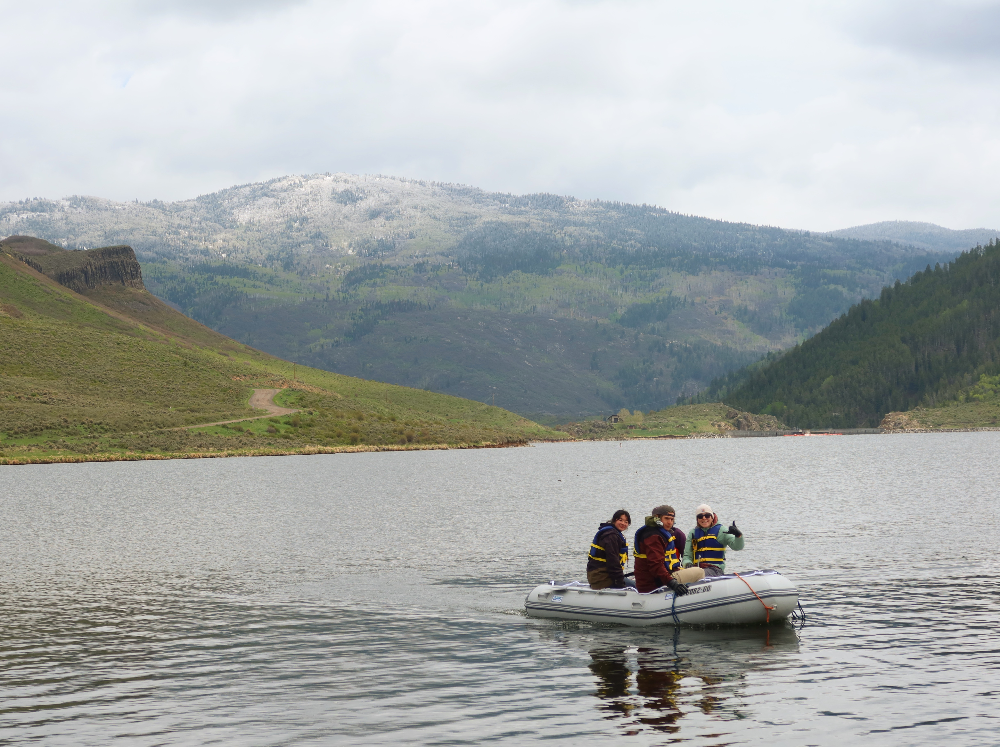
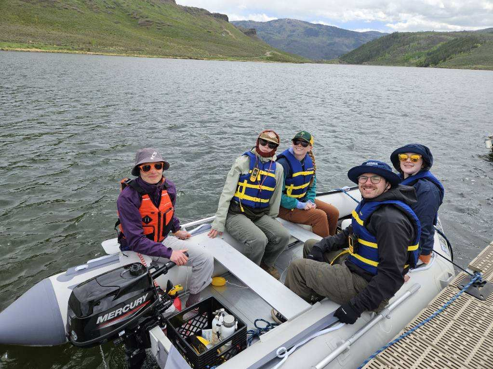

# Project Introduction 

## **Sittin’ on the Boat in the Bays:** Spatial variability of the Stagecoach Reservoir water column in bays and coves
**Authors:** Fin Wolf, Jude Lowe, Katie Gonzalez




**Description:** \
The density of a body of water is controlled by its temperature and conductivity, and density is the major controller of circulation. The Yampa River was dammed into Stagecoach Reservoir in 1989 to support the growing population of northwest Colorado. While the Yampa River is the primary source of the Stagecoach Reservoir, rain water and multiple small inlets add water that have different temperatures and conductivities. The Stagecoach Reservoir’s complex system of coves with and without inlets has yet to be studied to understand how the water properties change temporally and spatially. Understanding how Stagecoach Reservoir is influenced by inlets could help in determining why the Reservoir experiences changes in water quality that impact local wildlife, drinking water, and water used for irrigation. During the 2025 Geophysics Field Camp, we used a Castaway CTD to collect novel temperature and conductivity profiles at varying pressures in Stagecoach Reservoir.

Here, we show how inlets affect the spatial variations in water density in Stagecoach Reservoir. By observing Castaway CTD profiles on the interactive Folium map we created, inlets in coves could be identified based on lower conductivities and temperatures relative to the rest of the cove. In a freshwater environment, such as Stagecoach Reservoir, the temperature is the primary parameter of water density, while conductivity plays less of a role. Water in areas closer to reservoir inlets was colder creating a dense cold layer that sank beneath the warmer. Our results demonstrate that in Stagecoach Reservoir, a cove fed by an inlet(s) had different temperature profiles and transects than a cove without. For further spatial analysis, data collected in following field sessions should be easily integrated with the interactive Folium map hosted in JupyterBook. In future years, Geophysics Field camp students should aim to expand this research through additional CTD measurements, as well as GPR surveys in the Keystone and Harding Bays and near the Yampa inlet, to better understand the role of inlets on a cove.

[Final Presentation Zoom and Recording]()

[Final Presentation Slidedeck Link](https://docs.google.com/presentation/d/1DcmgOKPc7_bOR6BeH6ql4NtxW7pAgQsuXQxhjuslWJg/edit?usp=sharing)\
[Daily Slides Link](https://docs.google.com/presentation/d/1EuON_ubTNge2zK6xclWC0R86vMqT2AaSYY39-BBsy38/edit?slide=id.g25846a4b5191903c_0#slide=id.g25846a4b5191903c_0)\
[AGU Abstract Document Link](https://docs.google.com/document/d/1wtGRIvyiCGJO4AiTk6FkhmpDdTv5TPpi1x-dwEx88zE/edit?tab=t.0)




:::{raw} html
<iframe src="notebooks/map.html" width="100%" height="600px"></iframe>
:::


Check out what we have measured and are investigating on the pages:

```{tableofcontents}
```
